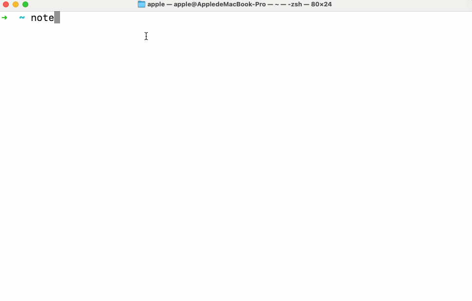

# Note CLI ✨

[](https://github.com/chloezhoudev/czhou-notes-cli/actions/workflows/ci.yml)
[](https://codecov.io/gh/chloezhoudev/czhou-notes-cli)

**Capture & search notes instantly from your terminal**
Take notes without breaking flow — built for terminal users who think fast and move faster.



## Install & Start
```
npm install -g czhou-notes-cli
note setup your_username
note add "Your first note"
```

## Upgrading from v1.x?
Version 2.0 introduces breaking changes:

- **User authentication now required** - run `note setup <username>` to get started
- **Cloud database storage** - your notes are now stored securely in the cloud
- **Migration needed** - run `note migrate` to transfer your existing local notes

See the [Migration](#migration) section below for detailed instructions.

## Requirements
- Node.js >= 18.0.0
- Internet connection (notes stored in cloud database)

## Essential Commands
```bash
# Getting started
note setup john_doe                   # One-time account setup
note add "Buy groceries"              # Add a note
note add "Meeting" --tags work urgent # Add with tags

# Finding your notes
note all                              # See all notes
note find "meeting"                   # Search by content or tags
note find work                        # Search by content or tags

# Managing notes
note remove 3                         # Delete note #3
note web                              # Open in browser
```

## All Commands

| Command | What it does |
|---------|-------------|
| `setup <username>` | Create account or login |
| `whoami` | Show current user |
| `logout` | Switch to different user |
| `add <note>` | Create a new note |
| `add <note> --tags <tags>` | Create note with tags |
| `all` | List all your notes |
| `find <filter>` | Search notes by content or tags |
| `remove <id>` | Delete a note by ID |
| `clean` | Delete all your notes |
| `migrate-check` | Preview what notes will migrate |
| `migrate` | Move old notes to new system |
| `web [port]` | Open notes in browser |

## Migration
What happens during migration:

- Your local notes are backed up automatically
- Notes are copied to your cloud account
- Original files stay untouched on your computer

**Step by step**:
```bash
# 1. Create your account first
note setup your_username

# 2. Check what will be migrated
note migrate-check
# Shows: "📊 Found 5 legacy notes: ✅ 5 notes would be migrated"

# 3. Run the migration
note migrate
# Shows progress and confirms: "✅ Migration completed successfully! 5 notes migrated."
```

**Troubleshooting:**
- **"No user session found"** → Run `note setup <username>` first
- **Want to preview?** → Use `note migrate-check` to see what will move
- **Worried about data loss?** → Don't be! Your original notes are automatically backed up

## 🌟 Love this tool?
- **Star the repo** → [GitHub](https://github.com/chloezhoudev/czhou-notes-cli)
- **Share a tip**: `note add "Pro tip: Use --tags for context!"`

## License
MIT

## Contributing
Contributions are welcome! Please read our [Code of Conduct](CODE_OF_CONDUCT.md).
